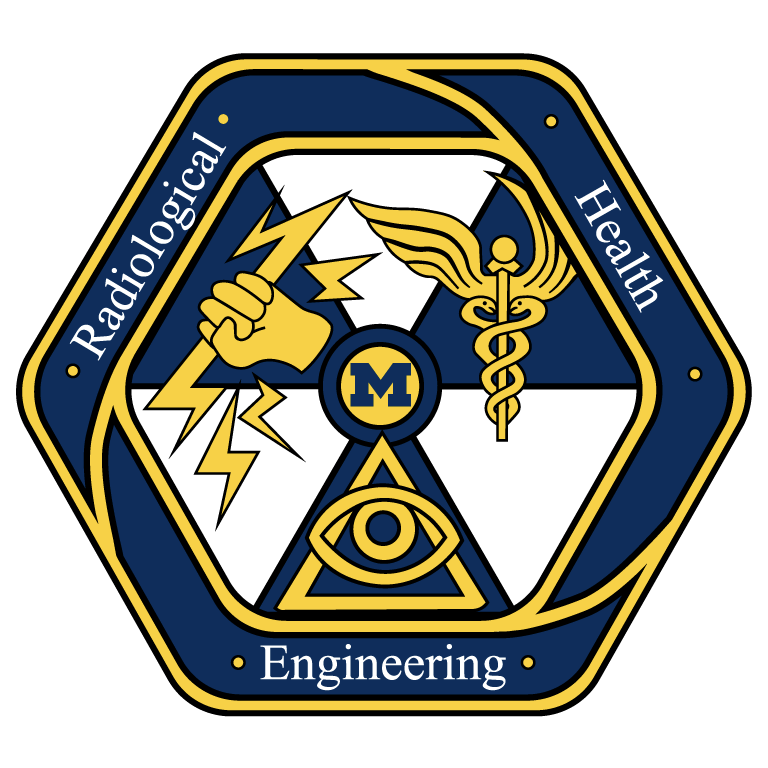
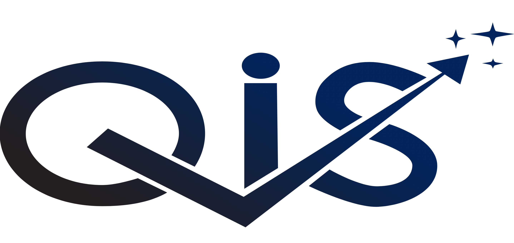
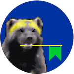

## Education
#### University of Michigan

<table>
  <tr>
    <td>BS Honors Mathematics, Computer Science</td>
    <td>Expected 2025</td> 
  </tr>
  <tr>
    <td colspan=2><b>Courses:</b> Honors Real Analysis & Group Theory, Honors Manifold Analysis, Topology, Algorithms, Computability, Operating Systems  
    <b>Graduate Courses:</b> Probability, Network Theory, Parallel Computing, Numerical Linear Algebra</td></td>
  </tr>
</table>

## Experience
<table>
    <thead>
        <tr>
            <th>Company</th>
            <th>Link</th>
            <th>Role</th>
            <th>Dates</th>
            <th>Location</th>
        </tr>
    </thead>
    <tbody>
        <tr>
            <td rowspan=2></td>
            <td rowspan=2>Amazon Web Services</td>
            <td>Software Development Engineer Intern</td>
            <td>May 2023 - Jul 2023</td>
            <td rowspan=2>Seattle, WA</td>
        </tr>
            <tr>
                <td>&nbsp;&nbsp;Propel SDE Intern</td>
                <td>May 2022 - Aug 2022</td>
                <!-- <td>Seattle, WA</td> -->
            </tr>
        <tr>
            <!-- <td></td> -->
            <td></td>
            <td>Radiological Health Engineering Lab</td>
            <td>Research Assistant</td>
            <td>Oct 2021 - Present</td>
            <td>Ann&nbsp;Arbor, MI</td>
        </tr>
        <tr>
            <td></td>
            <td><a href="https://qisumich.com/" target="_blank">Quantitative Investment Society</a></td>
            <td>President</td>
            <td>Oct 2021 - Present</td>
            <td>Ann&nbsp;Arbor, MI</td>
        </tr>
        <!-- <tr>
            <td></td>
            <td>Amazon Web Services</td>
            <td>Software Development Engineer Intern</td>
            <td>May 2022 - Aug 2022</td>
            <td>Seattle, WA</td>
        </tr> -->
        <tr>
            <td></td>
            <td>Michigan Mars Rover</td>
            <td>Computer Vision Team Member (CUDA)</td>
            <td>Oct 2021</td>
            <td>Ann&nbsp;Arbor, MI</td>
        </tr>
        <tr>
            <td></td>
            <td><a href="https://wolvsec.org/" target="_blank">WolvSec</a></td>
            <td>CTF Challenge Writer, Competitor</td>
            <td>Oct 2021</td>
            <td>Ann&nbsp;Arbor, MI</td>
        </tr>
    </tbody>
</table>

---
## Skills
<b>Languages:</b> C++, C, Python, Typescript, Julia, Java  
<b>Frameworks:</b> CUDA, React, ROS 
<b>Tools:</b> Ghidra, Radare, GDB, BurpSuite  
<b>Libraries:</b> Tensorflow, Thrust, OpenGL, Eigen, scikit-image, pwn tools, QT  
<b>Services:</b> AWS Lambda, DynamoDB, Cloudfront, S3, API Gateway, EC2